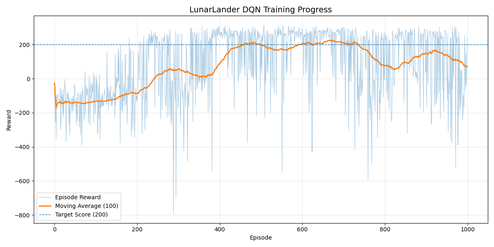
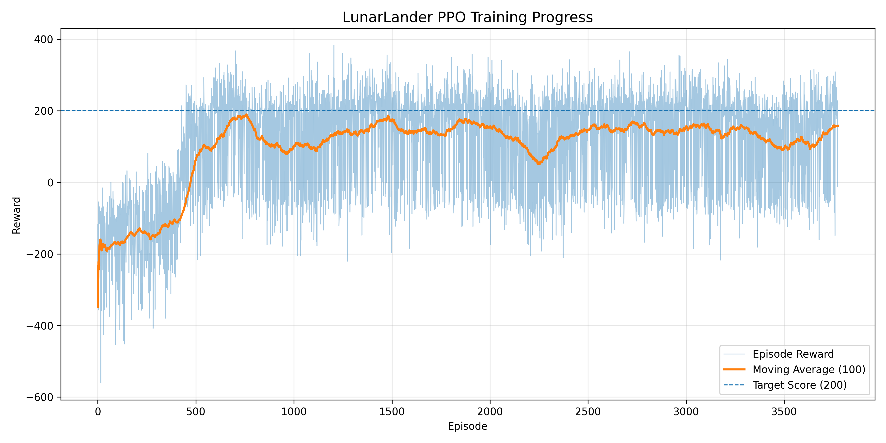

# RL LunarLander-v3

A Personal Reinforcement Learning Project Exploring DQN and PPO

## Overview

This repository contains two reinforcement learning implementations for solving the Gymnasium LunarLander-v3 environment.

Implemented algorithms:

- Deep Q-Network (DQN)
- Proximal Policy Optimization (PPO)

The project was developed as a self-learning reinforcement learning exercise to compare value-based and policy-based approaches on the same benchmark environment.

## What I Learned

During this project I explored:

- Markov Decision Processes (MDP)
- Reward design
- Exploration vs Exploitation
- Experience Replay
- Target Networks
- Deep Q-Networks (DQN)
- Policy Gradient Methods
- Proximal Policy Optimization (PPO)

This project helped me gain practical experience implementing and training reinforcement learning agents from scratch.

## Algorithms
### Deep Q-Network (DQN)
DQN is a value-based reinforcement learning algorithm that approximates the action-value function using a neural network. It learns policies through experience replay and bootstrapped targets.

### Proximal Policy Optimization (PPO)
PPO is a policy-gradient method that improves training stability through clipped policy updates and has become one of the most widely used RL algorithms for continuous and discrete control tasks.

## Environment

- Python 3.x
- Gymnasium
- PyTorch
- NumPy
- Matplotlib

## Installation

```
git clone https://github.com/Januaraine/rl_lunarlander_v3.git    
cd rl_lunarlander_v3   
pip install -r requirements.txt   
```

## Project Structure

```
rl_lunarlander_v3/
│
├── RL_DQN_lunarlander_v3/
│   ├── agent_LunarLander-v3.py      # DQN training and evaluation
│   ├── dqn.py                       # DQN network implementation
│   ├── best_dqn_lunarlander.pth     # Best-performing DQN model
│   ├── dqn_lunarlander.pth          # Final trained model
│   ├── training_progress_1.png      # Training reward curve
│   ├── training_progress_2.png      # Additional training statistics
│   └── README.md
│
├── RL_PPO_lunarlander_v3/
│   ├── LunarLander-v3_ppo.py        # PPO implementation
│   └── training_progress.png        # PPO training curve
│
├── README.md
└── LICENSE
```

## Results

### DQN Training



### PPO Training




## License

This project is released under the MIT License.


